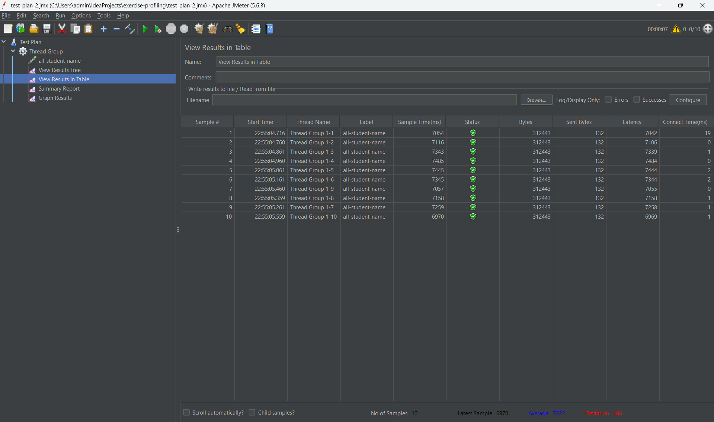
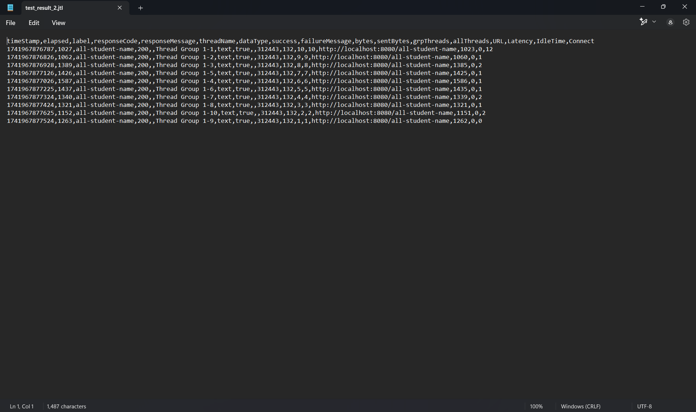
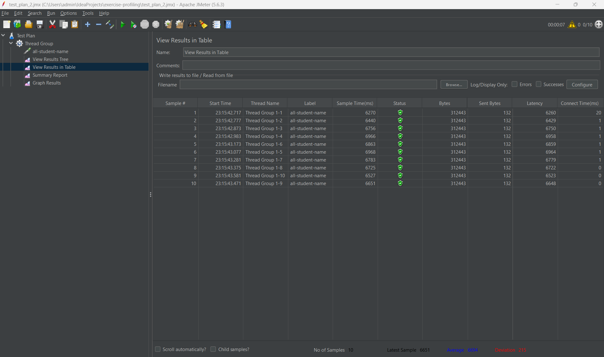
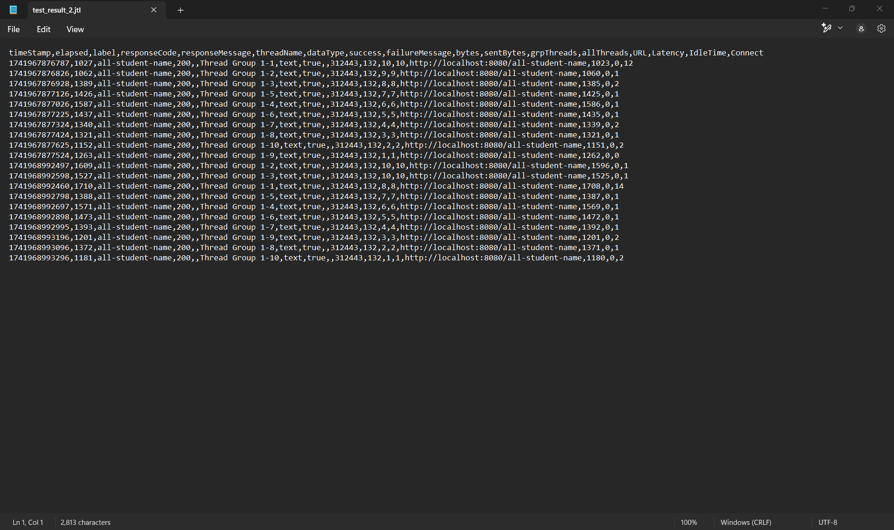
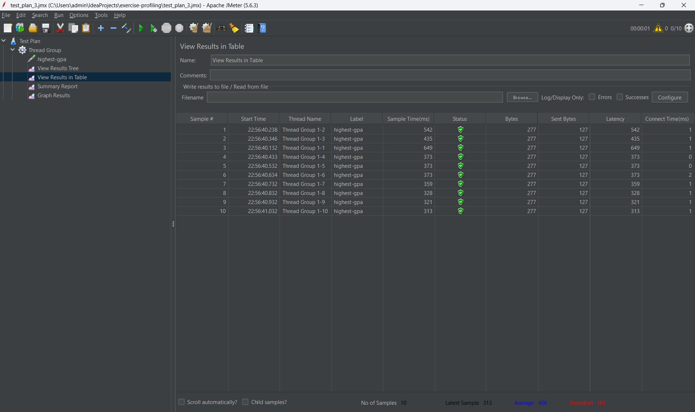
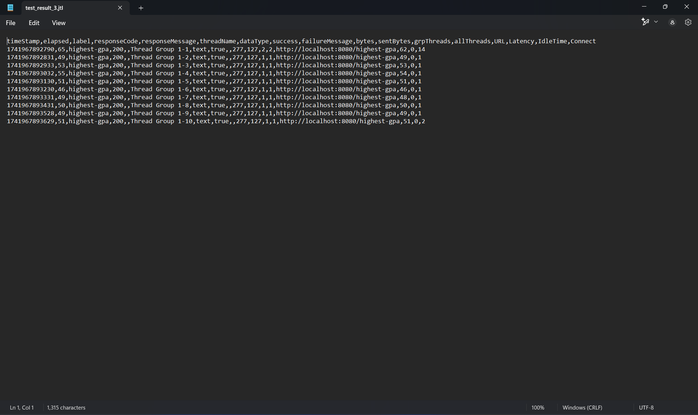
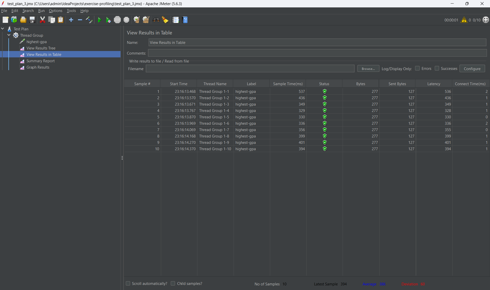
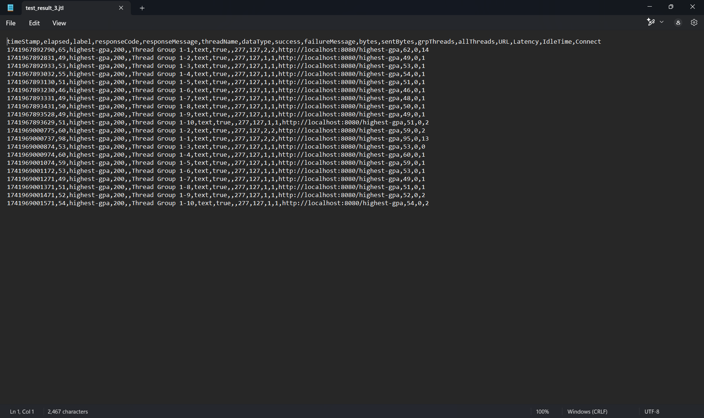

### All Student Names  

#### Before Optimization  
  
  

#### After Optimization (Method: joinStudentNames)  
  
  
---  

### Highest GPA  

#### Before Optimization  
  
  

#### After Optimization (Method: findStudentWithHighestGpa)  
  
  
---  

## Conclusion  
After optimizing several methods for different endpoints, I observed a significant improvement in performance.  

# Reflection 1

> 1. What is the difference between performance testing with JMeter and profiling with IntelliJ Profiler in the context of optimizing application performance?  

Performance testing with JMeter focuses on evaluating the overall application performance, particularly under high user load or stress conditions. On the other hand, profiling with IntelliJ Profiler provides a detailed analysis of the application's code, helping identify specific sections that cause slowdowns or inefficiencies. In short, JMeter assesses general system performance, while IntelliJ Profiler pinpoints performance issues at the code level.  

> 2. How does the profiling process help you identify and understand weak points in your application?  

IntelliJ Profiler is quite useful in analyzing performance issues because it provides clear insights through tools like flame graphs, call trees, and timelines. These visualizations make it easier to identify performance bottlenecks, allowing me to jump directly to problematic sections of the code without manual navigation.  

> 3. Do you think IntelliJ Profiler is effective in helping you analyze and identify bottlenecks in your application code?  

Yes, it is quite effective. The flame graph and call tree features make it easy to pinpoint problematic areas in the code. These tools allow me to quickly identify performance issues and determine their root causes.  

> 4. What are the main challenges you face when conducting performance testing and profiling, and how do you overcome them?  

Initially, the biggest challenge was understanding the profiling results, as I was unfamiliar with some of the features. Additionally, the results were sometimes inconsistent, making analysis more difficult. To address this, I conducted repeated tests to ensure stable results and studied the profiler’s visualization tools more thoroughly to better understand performance issues.  

> 5. What are the main benefits of using IntelliJ Profiler for profiling your application code?  

The biggest advantage is the ability to quickly and clearly identify performance bottlenecks in the code. Compared to manually reading logs or analyzing code line by line, IntelliJ Profiler provides a much faster and more efficient way to detect and diagnose performance issues.  

> 6. How do you handle situations where profiling results from IntelliJ Profiler are not entirely consistent with performance testing results from JMeter?  

When discrepancies arise, I typically conduct additional tests while ensuring that both tools are used under the same conditions. Then, I analyze the differing results more closely to identify the cause of the inconsistency before deciding on the best optimization approach.  

> 7. What strategies do you use to optimize application code after analyzing performance testing and profiling results? How do you ensure that changes do not affect the application's functionality?  

After reviewing the results, I prioritize the methods that require optimization. I then refactor the code by improving inefficient algorithms and using more appropriate data structures. To ensure that these changes do not impact the application's functionality, I perform thorough testing after refactoring.